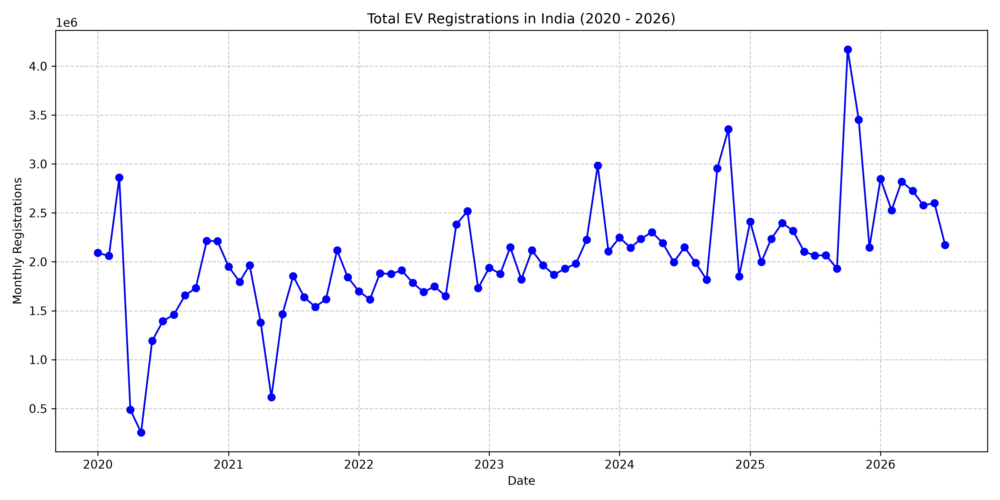
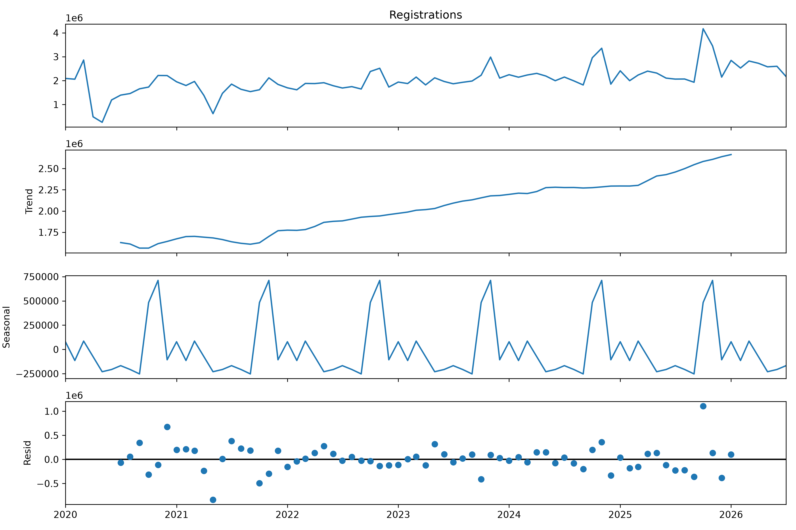

# Phase 2: Exploratory Data Analysis (VAHAN EV Registrations)

This document summarizes the Exploratory Data Analysis (EDA) on the VAHAN EV sales data collected between January 2020 and July 2026.

## 1. Raw Data Processing
We consolidated all the 7 VAHAN `reportTable*.xlsx` files into a single, structured, time-series dataset. The processed output contains **2,844 records** representing monthly EV registrations across all Indian states and Union Territories.

- **Start Date:** January 2020
- **End Date:** July 2026
- **Processed File:** [vahan_registrations.csv](../data/processed/vahan_registrations.csv)

## 2. Total Registrations Trend

Aggregating the registrations nationally over time reveals the overarching trend of EV adoption in India.

> [!NOTE]
> The adoption curve clearly shows rapid acceleration, likely correlated with major policy interventions (like the FAME-II extensions and state subsidies). 

## 3. Seasonal Decomposition

To properly forecast future sales (Phase 3), we decomposed the time series into **Trend**, **Seasonal**, and **Residual** components.

> [!TIP]
> The decomposition highlights a strong underlying upward trend, accompanied by a repeating seasonal pattern (e.g., spikes during festive seasons or financial year ends).

## 4. Stationarity Checks (ADF Test)

We performed an Augmented Dickey-Fuller (ADF) test to determine whether the time series is stationary (a prerequisite for models like ARIMA/SARIMAX).

**Level Series (Original Data):**
- **ADF Statistic:** 1.0568
- **p-value:** 0.9948
- **Conclusion:** The p-value is > 0.05. The time series is heavily non-stationary (as expected given the strong upward trend).

**First-Differenced Series:**
- **p-value:** 0.0000
- **Conclusion:** Taking the first difference of the series makes it stationary.

> [!IMPORTANT]
> Because the first difference is stationary, the optimal model architecture for Phase 3 should be an Integrated model (e.g., SARIMA with $d=1$) or Prophet (which natively handles strong trends).
